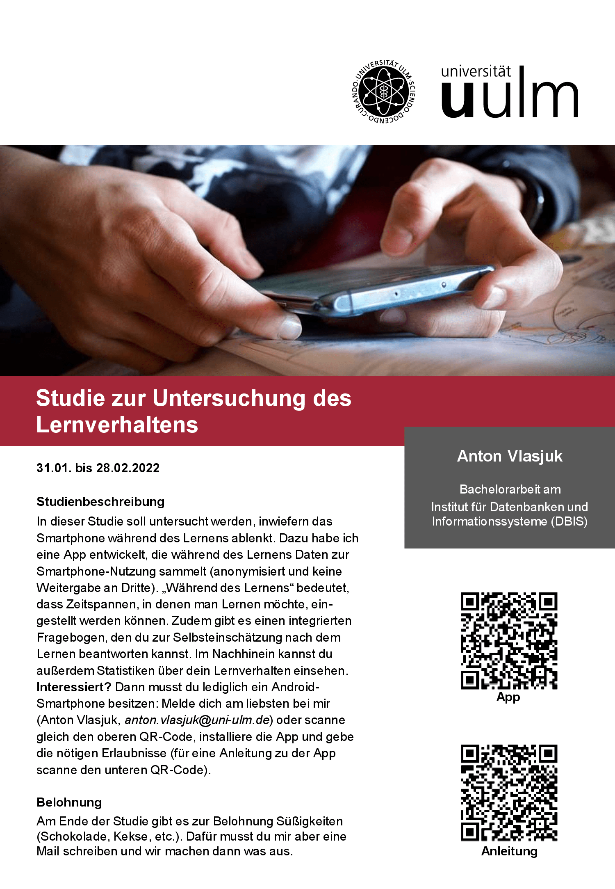

# Studie zur Untersuchung des Lernverhaltens

## Studienbeschreibung

In dieser Studie soll untersucht werden, inwiefern das Smartphone während des Lernens ablenkt. Dazu wurde eine App entwickelt, die während des Lernens Daten zur Smartphone-Nutzung sammelt (anonymisiert und keine Weitergabe an Dritte). „Während des Lernens“ bedeutet, dass Zeitspannen, in denen man Lernen möchte, definiert werden können. Zudem gibt es einen integrierten Fragebogen, der zur Selbsteinschätzung nach dem Lernen beantwortet werden kann. Und im Nachhinein können außerdem Statistiken über das Lernverhalten eingesehen werden. 

**Interessiert?**\
Dazu ist lediglich ein **Android**-Smartphone erforderlich! Melde dich am besten direkt bei [Anton Vlasjuk](mailto:anton.vlasjuk@uni-ulm.de?subject=Studienteilnahme:%20Lernverhalten) oder scanne den QR-Code, installiere die App und gebe die nötigen Berechtigungen: Eine Anleitung zur Installation und Nutzung findest du [hier](tutorial/README.md).

## Belohnung

Am Ende der Studie gibt es als Dankeschön Süßigkeiten (Schokolade, Kekse, etc.). Dafür muss die Teilnahme per Mail an [Anton Vlasjuk](mailto:anton.vlasjuk@uni-ulm.de?subject=Studienteilnahme:%20Lernverhalten) gemeldet werden.

## Flyer

