# Inhaltsverzeichnis 

1. [Anleitung](#anleitung)
   1. [Installieren](#installieren)
   2. [Erlaubnisse](#erlaubnisse)
   3. [Weitere Features im Hauptmenü](#menu)
   4. [Lernsitzung](#lernsitzung)
   5. [Fragebogen](#fragebogen)
   6. [Statistiken](#statistiken)

## Anleitung

#### Installieren

Scanne folgenden QR-Code und installiere die App (Tutorial zu Installation von APKs: https://www.heise.de/tipps-tricks/Externe-Apps-APK-Dateien-bei-Android-installieren-so-klappt-s-3714330.html):

### Erlaubnisse 

Beim Starten der App wird nach App-Erlaubnissen gefragt, die für die Funktionalität der App notwending sind: 

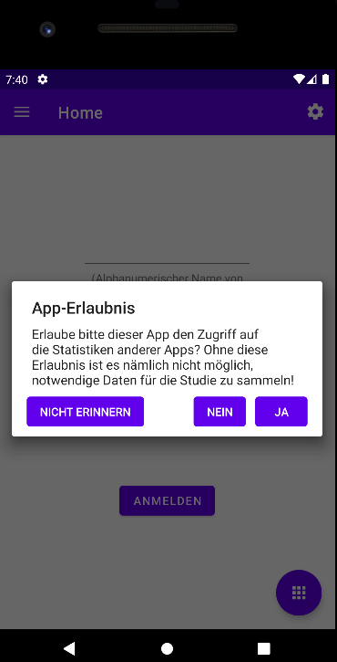

Bitte ''Ja'' auswählen, dann taucht eine Liste der installierten Apps auf. Hier soll dann entsprechend die ''Lernstudie'' ausgewählt werden:

 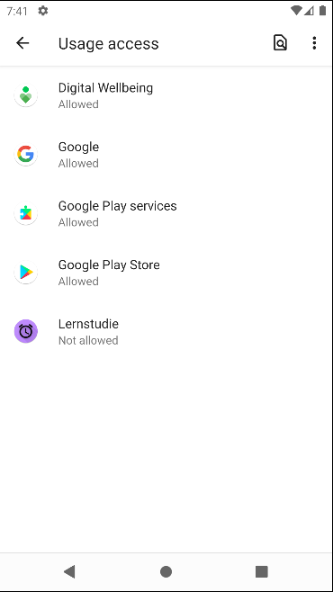 

Zuletzt soll hier die Erlaubnis gegeben werden und fertig: 

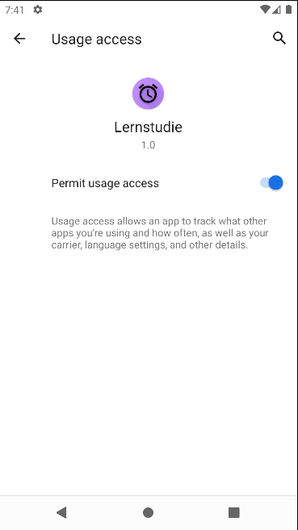 

Falls ''Nein'' oder ''Nicht erinnern'' am Anfang ausgewählt wurde, so kann man die Erlaubnisse nachträglich in den Einstellungen geben (Zahnrad im ersten Bild):

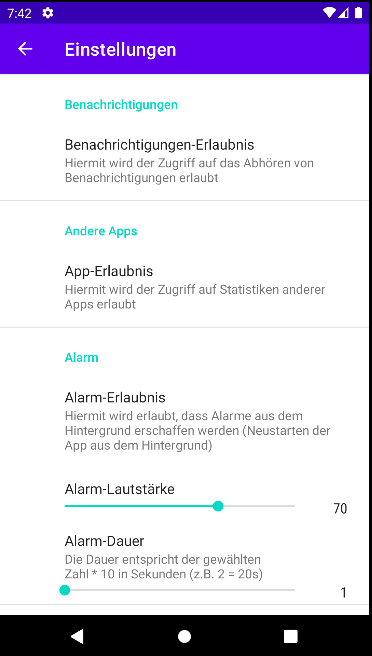 

Einfach entsprechend auf die Felder klicken.

### Anmelden 

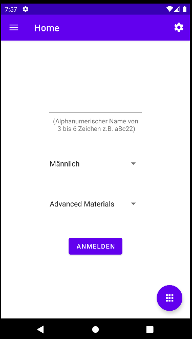 

Gebe einen Namen ein, der 3-6 Zeichen lang geht und nur Buchstaben (a-z) oder Zahlen enthält (0-9): z.B. test11. Gebe zusätzlich dein Geschlecht und deinen Studiengang an. Wenn du nun eine stabile Internetverbindung hast, dann drücke auf ''Anmelden'' (bei Erfolg ist keine Änderung mehr möglich; bei einem Fehlschlag kommt eine entsprechende Meldung).

​																													         **Fehlschlag**

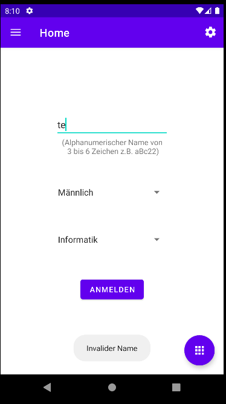 

​																														 		**Erfolg**

 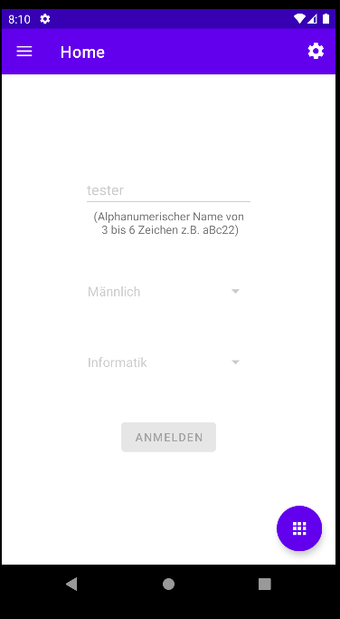 

### Weitere Features im Hauptmenü

Es gibt drei weitere Features im Hauptmenü (Klicke den runden Button unten rechts):

Als erstes kann man seine Daten aktualisieren (Daten an meinen Server schicken), falls mal keine Internetverbindung da war oder ähnliches: 

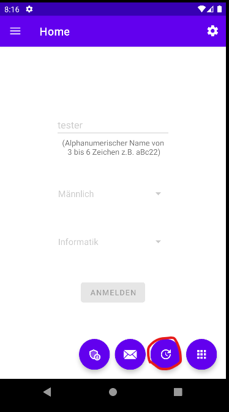

Als nächstes kann man eine E-Mail an mich schicken, falls die App nicht funktionieren sollte oder andere Probleme bestehen: 

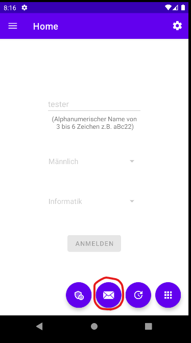

Zuletzt kann man sein Token erneuern, falls oft Meldungen kommen, dass man nicht angemeldet sei oder das Token ungültig sei: 

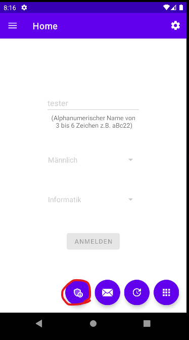

Falls dies wirklich nötig ist, so schreibe mir bitte eine E-Mail, dann können wir gemeinsam das Token erneuern: 

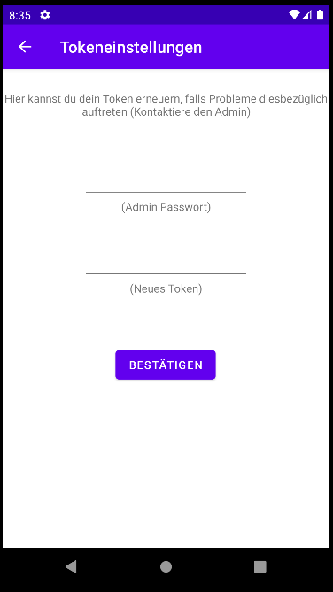

### Lernsitzung

Um auf die Lernsitzung zu kommen, musst du oben links klicken (oder von links nach rechts swipen): 

Dann öffnet sich folgendes, bei dem auf ''Lernsitzung'' geklickt werden soll: 

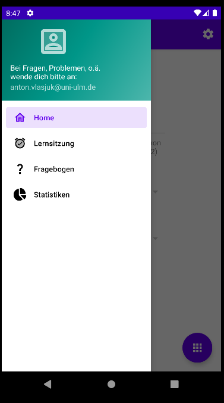

Nun befinden wir uns am Anfang der Lernsitzung: 

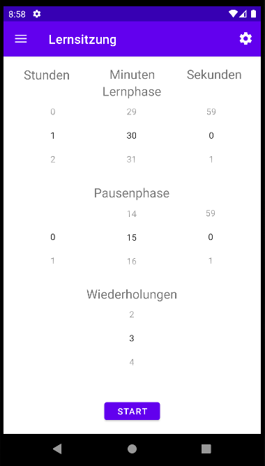

Hier kannst du einstellen, wie lang deine Lernsitzung gehen soll: Dauer einer Lernphase, Pause und die Anzahl der Wiederholungen (damit ist die Gesamtamzahl an Lernphasen gemeint). Wenn man zufrieden mit der Einstellung ist, kann man mit einem Klick auf ''Start'' die Lernphase beginnen. 

Zuvor aber noch eine Kleinigkeit: Falls man die Einstellung nicht immer wieder neu einrichten möchte, so kannst du bei den Einstellungen (Zahnrad oben rechts) einen Standard festlegen: 

Hier kann man auch den Alarm regulieren (Dauer und Lautstärke). Wenn nämlich eine Phase auf natürliche Weise zu Ende geht, so startet ein Alarm:

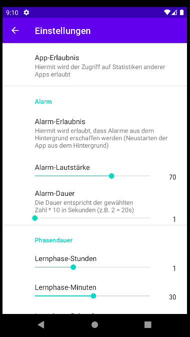

Jetzt zur Lernsitzung an sich. Wenn eine Lernsitzung gestartet wurde, so wird die verbleibende Zeit entsprechend auf dem Bildschirm angezeigt (und auch als Benachrichtigung): 

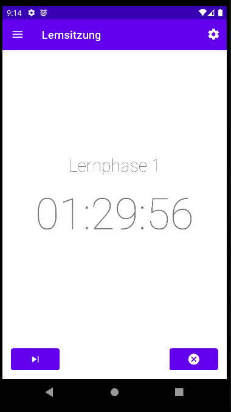

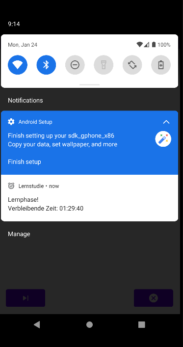

Mit dem Button links unten kann man eine Phase frühzeitig abschließen; mit dem Button rechts unten kann man die Lernsitzung abbrechen. 

Zuletzt wird eine Benachrichtigung am Ende einer Lernsitzung geschickt, die darum bittet den Fragebogen auszufüllen. Dieser sollte insgesamt zumindest einmal gemacht werden, am besten einfach ab und zu nach der Lernsitzung oder wenn sich mal Zeit findet: 

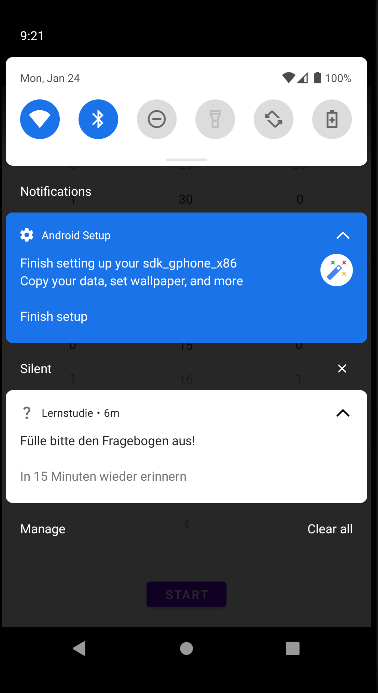

### Fragebogen

Um auf den Fragebogen zu kommen, musst du oben links klicken (oder von links nach rechts swipen): 

Dann öffnet sich folgendes, bei dem auf ''Fragebogen'' geklickt werden soll: 

Jetzt befindest du dich am Anfangsbildschirm des Fragebogens. Bei einem Klick auf dem Bildschirm startet dann der Fragebogen: 

Dort sind einige Fragen, die du dann ausfüllen sollst. Mit Swipen oder mit Klicken auf der oberen Leiste kann man entsprechend die Fragen wechseln: 

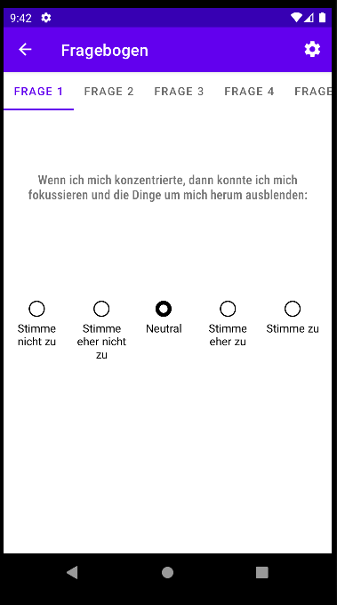

Am Ende kannst du dann deine Antworten einreichen (mit einem Klick auf den Bildschirm): 

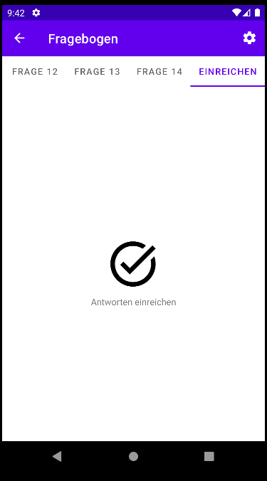

### Statistiken

Um auf die Statistiken zu kommen, musst du oben links klicken (oder von links nach rechts swipen): 

Dann öffnet sich folgendes, bei dem auf ''Statistiken'' geklickt werden soll: 

Am Anfangsbildschirm kannst du zwischen zwei Typen von Statistiken auswählen: Oben - Fragebogenstatistiken, Unten - Lernsitzungsstatistiken: 

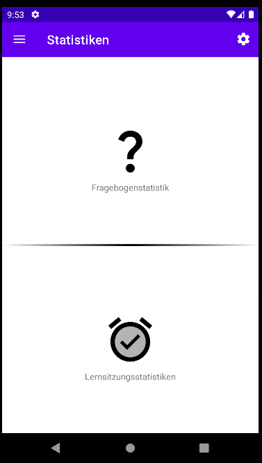

Die Statistiken für den Fragebogen sehen so aus:

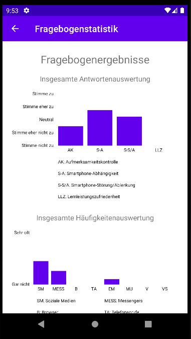

Der Anfang der Lernsitzungsstatistiken zeigt eine Auswahl der verschiedenen Lernsitzungen (anhand des Datums und des Endes der Sitzung) und auch eine gesamte Statistik:

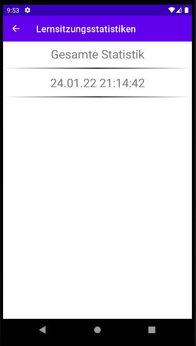

Auf den folgenden Seiten werden nun Beispielbilder gezeigt.

​																											  		 	 **Lernsitzung**

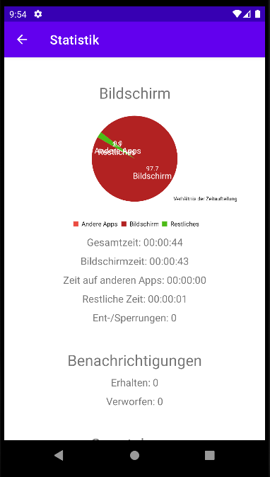

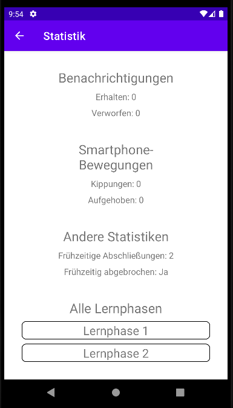

​																													    	  **Lernphase**

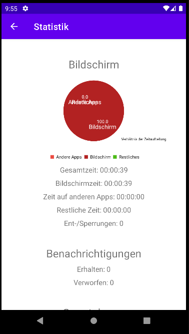

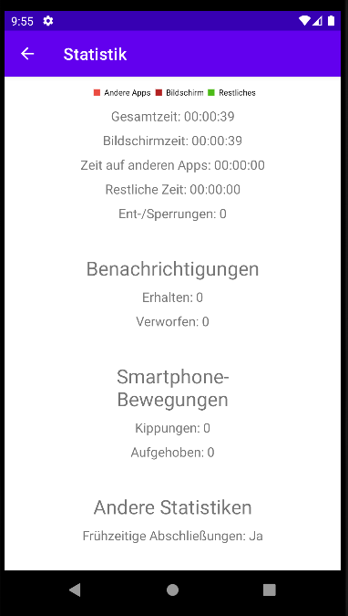

​																																**Gesamt**

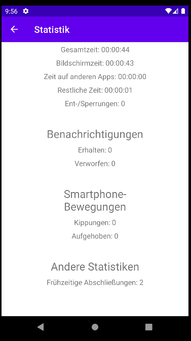
